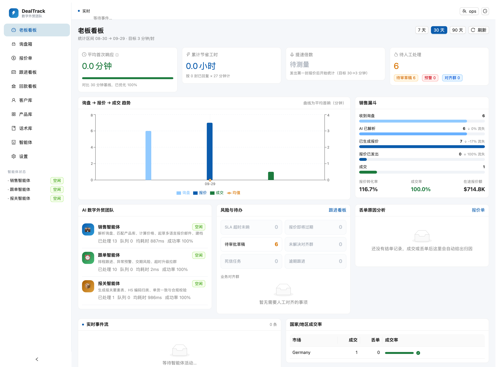
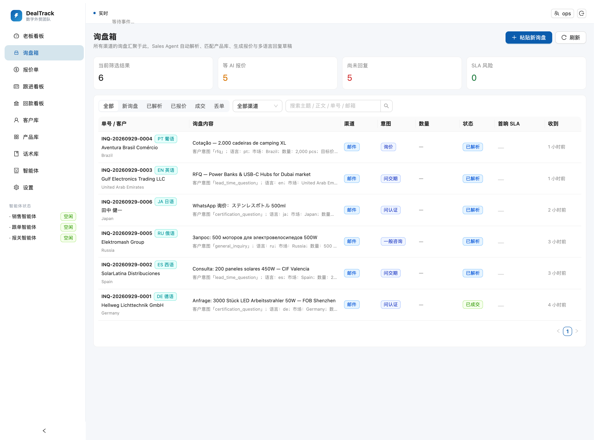
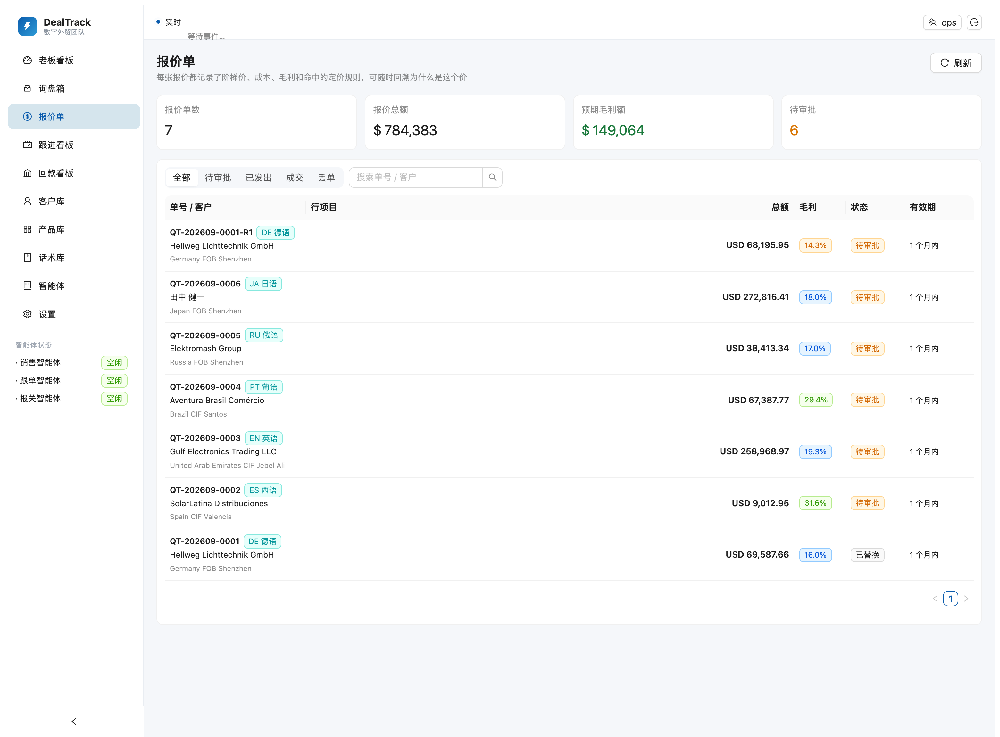
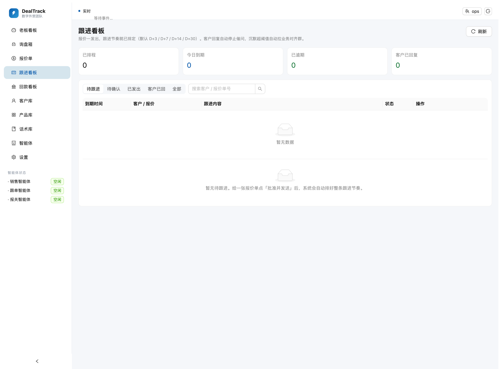
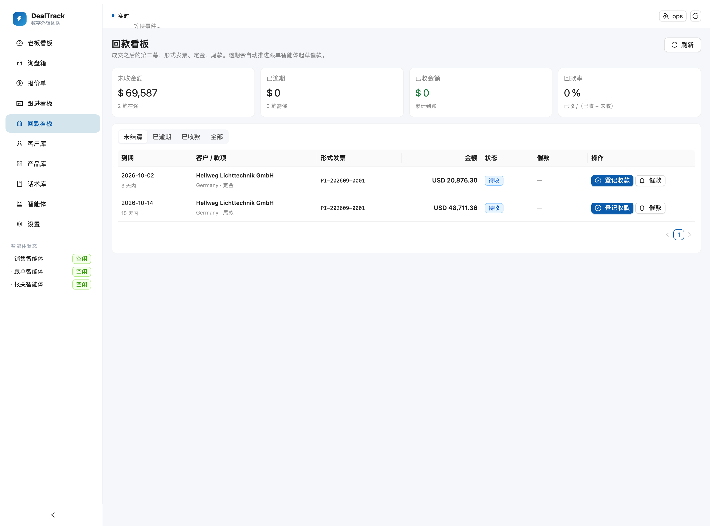
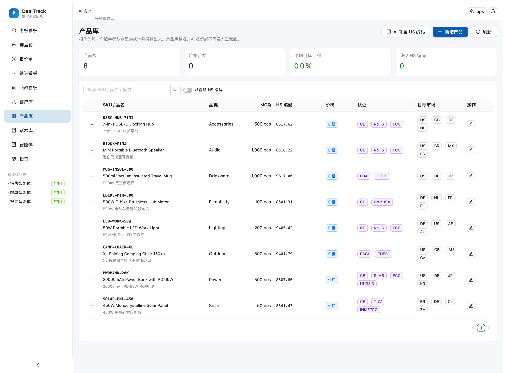
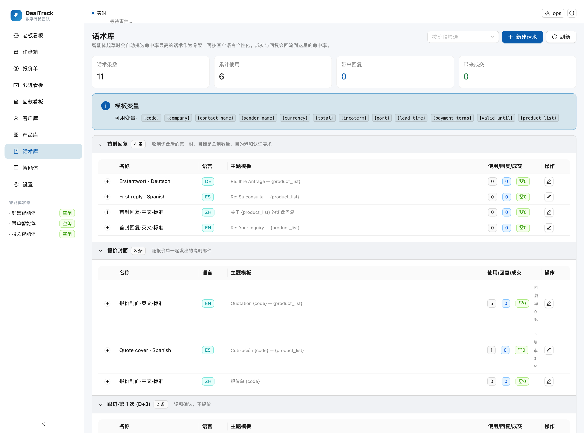
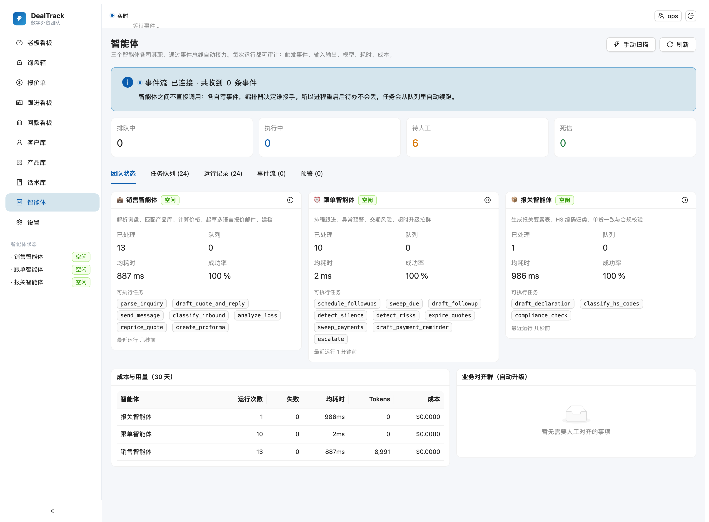
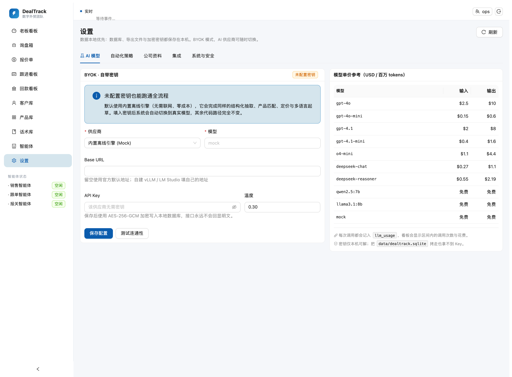

# DealTrack · 数字外贸团队

> 把「**30 分钟/封**」变成「**3 分钟/封**」，并且**不漏跟**。
>
> 跨境小卖家的询盘 → 报价 → 跟进一体化工作台。它不是又一个 CRM ——
> 它是一个能自动干活的 AI 外贸团队：**多智能体（Multi-Agent）协作 + 事件驱动自动化**。

<p>
  
  
  
  
  
</p>

---

## 它到底解决什么问题

一个跨境小卖家每天的真实状态：

| 现状 | 代价 |
|---|---|
| 收到德文/西文/阿语询盘，逐句翻译、翻产品表、查上次报价 | **30 分钟/封** |
| 报价发出去，客户没回，三天后忘了，两周后想起来已经凉了 | **丢单不知道为什么** |
| 老板想知道这周询盘多少、报价多少、为什么丢单 | **只能靠问** |
| 报关要素每次重新填，HS 编码靠老师傅记忆 | **出错就压港** |

DealTrack 把第一项压到 **3 分钟**（AI 做完 27 分钟，你只审 3 分钟），把第二项变成**系统排程**，第三项变成**看板**，第四项交给**报关智能体**。

---

## 三个智能体，怎么协作

```
                      ┌─────────────────────────────────────────┐
   客户邮件/WhatsApp ─▶│  inquiry.received  （事件总线 + 持久化） │
                      └────────────────────┬────────────────────┘
                                           │ 编排器按路由表派活
                      ┌────────────────────▼────────────────────┐
                      │ 销售智能体  Sales Agent                  │
                      │ · 解析询盘（语言/产品/数量/条款/认证）    │
                      │ · 匹配产品库、自动建档                    │
                      │ · 按阶梯成本算 FOB / CIF / DDP           │
                      │ · 用客户语言起草报价邮件                  │
                      └────────────────────┬────────────────────┘
                                           │ quote.created
                      ┌────────────────────▼────────────────────┐
                      │ 跟单智能体  Follow-up Agent              │
                      │ · 报价一发出，整条节奏就排好 D+3/7/14/30  │
                      │ · 到期自动起草催问（客户语言）             │
                      │ · 客户一回复 → 自动停掉全部催问            │
                      │ · 沉默超阈值 → 拉「业务对齐群」并 @ 负责人  │
                      │ · 交期风险 / 报价将过期 → 预警             │
                      └────────────────────┬────────────────────┘
                                           │ quote.accepted
                      ┌────────────────────▼────────────────────┐
                      │ 报关智能体  Customs Agent                │
                      │ · 生成报关要素表（HS / 申报要素 / 重量）   │
                      │ · 单货一致、目的国认证、制裁初筛           │
                      │ · 问题自动拉群，不带着隐患出货             │
                      └─────────────────────────────────────────┘

                      老板数据看板：漏斗 / 首响时长 / 智能体忙闲 / 丢单归因
```

### 关键设计：智能体之间**不互相调用**

每个智能体干完活只做一件事 —— **写事件**。由编排器（`agents/orchestrator.ts`）的**声明式路由表**决定谁接手。

这一条决定带来三个后果：

1. **可恢复**：进程崩了，`events` + `agent_tasks` 就是待办清单，重启自动续跑。这是「不漏跟」的工程基础，不是靠人记性好。
2. **可审计**：每一次运行都记下触发事件、输入输出、模型、耗时、成本。
3. **可扩展**：加一个能力 = 加一行路由，而不是改十个智能体。

---

## 界面预览

> 以下截图由 `npm run screenshots` 自动生成（Chrome DevTools Protocol，同时校验页面真实渲染而非空白页）。

### 老板看板
首响时长对比 30 分钟基线、累计节省工时、询盘→报价→成交漏斗、智能体忙闲、丢单归因。



### 询盘箱
所有渠道汇聚；AI 解析摘要直接显示在列表上，一眼看出客户要什么、要多少。



### 报价单
每张报价都带毛利、成本构成与命中的定价规则，可完整回溯「这个价怎么算出来的」。



### 跟进看板
逾期高亮；客户语言已就位，一键起草/发送/延后。



### 回款看板
成交之后的第二幕：形式发票、定金、尾款。逾期自动推进跟单智能体起草催款。



### 产品库
数量分档成本 + 目标毛利，报价引擎的直接输入。



### 话术库
按阶段与语言组织，命中率（回复/成交）自动回流，越用越准。



### 智能体
三个智能体的忙闲、队列、成功率与 Token 成本；任务、运行记录、实时事件流、预警。



### 设置
BYOK 模型配置、自动化策略、邮件/WhatsApp/OCR 集成、API Token 轮换。



---

## 快速开始（3 分钟）

```bash
git clone https://github.com/Lives0808/DealTrack.git
cd DealTrack
npm install                 # 安装后端 + 前端依赖

npm run seed --workspace=server -- --with-samples
# ↑ 写入演示产品库/话术库，并注入 6 条多语言真实询盘跑完整流水线

npm run build               # 构建后端 + 前端
npm start                   # 启动：http://localhost:8787
```

打开 <http://localhost:8787> 就能看到看板、询盘箱和已经生成好的报价单。

**不需要任何 API Key。** 默认走内置离线引擎，完整跑通解析 → 匹配 → 定价 → 多语言起草。
想接真实模型，在「设置 → AI 模型」里填 Key 即可（BYOK，支持 OpenAI / DeepSeek / Ollama / 任意 OpenAI 兼容端点）。

### 验证它真的能跑

```bash
npm run smoke --workspace=server
```

端到端冒烟测试，**83 项断言**，覆盖从「一封德文询盘进来」到「成交开 PI、收定金、改版报价」的全链路：

```
【2】多语言询盘接入（6 条）
  ✔ 语言自动识别 — de/es/en/pt/ru/ja
【3】智能体流水线
  ✔ 产品库匹配命中 — 6/6 条匹配到 SKU
【4】报价生成
  ✔ 毛利为正且可审计 — 24.0%/17.0%/27.6%/...
  ✔ CIF 报价含运费分摊 — QT-202609-0004 USD2400
【5】多语言回复草稿
  ✔ 草稿语言跟随客户 — zh/ru/pt/en/es/de
【7】跟进排程（不漏跟）
  ✔ 跟进按 D+3/7/14/30 分布
【9】客户回复 → 自动停止跟进
  ✔ 客户回复后停止跟进 — 4 → 0
【10】成交 → 报关要素表 + 合规校验
  ✔ 合规校验执行 — 7 项检查
【13】成交链路：形式发票 + 回款节点
  ✔ 成交后自动生成形式发票 — PI-202609-0001 总额 USD 69587.66
  ✔ 定金/尾款按付款条款拆分 — 定金 20876.30 (30%) + 尾款 48711.36
  ✔ 登记收款后节点完结 — paid
【14】报价改版（保留谈判历史）
  ✔ 改版链完整 — QT-202609-0001 → QT-202609-0001-R1
【16】回复识别收紧（不把新项目并进旧对话）
  ✔ 老客户的新项目另建询盘 — 新建 INQ-20260929-0007
【17】部分匹配必须显式暴露（不能静默丢行）
  ✔ 开启自动发送时，缺行的报价仍被拦下 — 状态 pending_approval
【18】报价过期与失联自动结单
  ✔ 超期后自动登记 no_response — no_response
```

---

## 功能地图

### 销售智能体
- **自动解析**：语言（17 种）、产品、数量、目标价、贸易条款、目的港、认证要求、紧急度
- **产品库匹配**：SKU / 品名 / 品类 / 目标市场加权打分
- **自动建档**：按邮箱、电话、公司去重，回填国家（ISO 码）与客户语言
- **多档定价**：`(单位成本 + 包装 + 内陆) ÷ 汇率 ÷ (1 − 目标毛利)`，再按条款分摊运费/保险/关税
- **规则引擎**：大单毛利下调、小单加价、整柜免运费、重点客户折扣、市场加价 —— 全部可审计
- **底价保护**：任何折扣或规则都不能把毛利压穿下限
- **多语言起草**：话术库出骨架 → LLM 个性化 → 保证母语级问候/落款

### 跟单智能体（「不漏跟」的所在）
- **自动排程**：报价发出即排好 D+3 / D+7 / D+14 / D+30
- **自动停止**：客户一回复，待发催问全部作废（不骚扰已回复的人）
- **到期提醒 + 自动起草**：每条都用客户的语言
- **异常预警**：报价将过期、客户沉默超阈值、交期承诺超出客户要求、草稿滞留超 6 小时
- **自动拉群**：需要人时，创建「业务对齐群」并 @ 负责人，而不是发一条没人看的通知

### 成交之后：PI 与回款
- **形式发票**：成交即自动生成（多语言、含银行信息与付款计划），行项目复用报价行避免对账差异
- **回款节点**：按付款条款自动拆定金/尾款，逾期自动预警
- **催款**：跟单智能体起草客户语言的催款信，72 小时内不重复打扰
- **回款看板**：未收 / 逾期 / 已收 / 回款率，逾期置顶

### 报关智能体
- **报关要素表**：品名 / HS 编码 / 申报要素 / 数量 / 净重毛重 / 体积 / 认证
- **HS 自动归类**：命中产品库既有编码；新品按品名材质离线归类，置信度 < 0.55 自动拉群请人工确认
- **合规校验**：单货一致、申报价值、重量数据完整性、目的国强制认证（CE/FCC/SASO/INMETRO/EAC/PSE/KC）、制裁禁运初筛

### 老板数据看板
- 平均首次响应时长 vs 30 分钟基线 vs 3 分钟目标
- 累计节省工时、提速倍数
- 询盘 → 解析 → 报价 → 发出 → 成交 漏斗与逐级流失
- 智能体忙闲、队列深度、成功率、Token 成本
- 丢单归因排行 + 分国家成交率

---

## 技术栈

| 层 | 选型 | 为什么 |
|---|---|---|
| 多智能体框架 | 自研事件驱动编排器（TypeScript） | 无框架锁定；路由表可读、可测、可回放 |
| 事件与队列 | SQLite 持久化（`events` / `agent_tasks` / `agent_runs`） | 进程重启不丢待办；单机零依赖 |
| LLM 层 | **BYOK**：OpenAI / DeepSeek / Ollama / 任意兼容端点 + 内置离线引擎 | 无供应商锁定；离线可演示；密钥 AES-256-GCM 加密 |
| 数据层 | SQLite（`node:sqlite`，无原生编译）；SQL 为 ANSI 风格便于换 PostgreSQL | 本地优先；一条 `npm install` 就能跑 |
| 文档处理 | Chrome headless 渲染 HTML → PDF | 真排版、真 CJK、真 RTL，多语言报价单 |
| 前端 | React 18 + Vite + Ant Design 5 + Recharts | 老板看板需要成熟的表格与图表 |
| 安卓端 | Kotlin + Jetpack Compose + OkHttp | **真原生**，不是 WebView 壳 |
| 邮件 | IMAP（imapflow）+ SMTP（nodemailer） | 幂等入站（按 Message-ID 去重） |
| WhatsApp | Business Cloud API + Webhook | 官方通道 |

---

## 项目结构

```
DealTrack/
├── server/                      Node + TypeScript 后端
│   └── src/
│       ├── core/                领域内核
│       │   ├── schema.ts         28 张表（产品/客户/报价/成交丢单/话术/事件/任务…）
│       │   ├── events.ts         事件总线 + 事件目录（持久化）
│       │   ├── queue.ts          持久化任务队列：认领/退避重试/死信/去重
│       │   ├── pricing.ts        FOB/CIF/DDP 定价引擎 + 规则引擎 + 底价保护
│       │   ├── i18n.ts           17 国语言话术库（含阿语 RTL、日中韩完整正文）
│       │   ├── ingest.ts         统一入站漏斗（邮件/WhatsApp/网页/手工）
│       │   ├── llm/              BYOK 供应商 + 结构化输出校验与修复
│       │   ├── repos/            数据访问层
│       │   └── settings.ts       配置 + 密钥加密
│       ├── agents/              销售 / 跟单 / 报关 三个智能体 + 编排器
│       ├── docgen/              报价单与报关要素表（HTML → PDF）
│       ├── integrations/        IMAP/SMTP、WhatsApp、OCR
│       ├── api/                 REST + SSE
│       └── scripts/             seed / smoke
├── web/                         React 控制台（9 个页面）
├── android/                     Kotlin + Compose 原生 App
├── docs/                        架构 / API / 部署 / 路线图
└── data/                        运行时数据（SQLite、导出文档、密钥；已 gitignore）
```

---

## 安卓原生 App

`android/` 是 **Kotlin + Jetpack Compose** 写的原生应用（不是 WebView 壳），定位是「口袋里的确认按钮」：

| 页面 | 作用 |
|---|---|
| 老板看板 | 首响时长、节省工时、漏斗、智能体忙闲、丢单归因 |
| 询盘箱 | 全部渠道询盘；FAB 粘贴新询盘，AI 自动解析报价 |
| 询盘详情 | AI 解析结果 → 待确认草稿 → 一键发送 → 报价单 → 原始邮件 |
| 报价单 | 毛利与成本构成、价格审计、批准发送、打开多语言 PDF 与报关要素 |
| 跟进看板 | 逾期高亮、一键起草/发送/延后 |
| 设置 | 服务器地址、Token、连接自检、能力说明 |

```bash
cd android
echo "sdk.dir=$HOME/Library/Android/sdk" > local.properties
./gradlew assembleDebug        # 调试包
./gradlew assembleRelease      # 发布包
```

真机连接：手机和电脑连同一 Wi-Fi，设置里填 `http://<电脑局域网IP>:8787`。
模拟器：默认 `http://10.0.2.2:8787` 即可直达宿主机。

---

## 配置（全部可选）

复制 `.env.example` 为 `.env`。**不配任何一项也能完整运行**（未配置的集成为「模拟发送」，流程照常推进）。

```bash
DEALTRACK_PORT=8787
DEALTRACK_API_TOKEN=change-me-in-production   # 安卓 App 与外部脚本用它

# BYOK：也可在「设置 → AI 模型」里填，界面优先
DEALTRACK_LLM_PROVIDER=mock                    # mock | openai | deepseek | ollama | openai-compatible
DEALTRACK_LLM_MODEL=deepseek-chat
OPENAI_API_KEY=
DEEPSEEK_API_KEY=

# 邮件（留空 = 模拟发送）
DEALTRACK_EMAIL_ENABLED=0
DEALTRACK_IMAP_HOST=
DEALTRACK_SMTP_HOST=

# WhatsApp Cloud API（留空 = 模拟发送）
DEALTRACK_WHATSAPP_ENABLED=0

# 文档渲染（自动探测；探测不到就只输出 HTML）
DEALTRACK_CHROME_PATH=
```

---

## 安全与合规

- **本地优先**：客户数据、报价历史、邮件正文默认全部留在本机；除你自己配置的 LLM 供应商外不向任何第三方传输。
- **密钥加密**：BYOK Key、SMTP 密码、WhatsApp Token 用 **AES-256-GCM** 加密后入库；主密钥在 `data/.master.key`（权限 600，已 gitignore）。拷走数据库拿不到密钥。
- **可审计**：每个事件、每次智能体运行、每条外发消息全部留痕，可用于响应 GDPR 数据主体请求。
- **人工兜底**：默认 `autoSend=false`，AI 生成的一切都要过人工确认才出门。

> 对外经营前还需补齐：隐私政策、数据处理协议（DPA）、访问日志留存策略，以及（面向企业客户时）ISO 27001 / SOC 2 认证。

---

## 路线图

见 [`docs/ROADMAP.md`](docs/ROADMAP.md)。近期方向：

- 报价一键转 PI / 形式发票与合同
- 多币种收款台账与应收账款提醒
- 客户门户（客户自助查看报价、确认订单）
- RAG 话术库（从历史成交邮件里自动学习高转化话术）
- PostgreSQL 适配器与多租户

---

## 开发中发现并修复的缺陷

| 缺陷 | 后果 |
|---|---|
| 日文询盘被识别为中文 | 客户收到中文邮件 |
| `1. 5,000 pcs` 解析成数量 15 | 报价数量错 300 倍 |
| 「500ml」被截成「ml」 | 报价单产品名损坏 |
| CIF 报价写成起运港 | `CIF Santos` 变成 `CIF Shenzhen` |
| 阿语单据用阿拉伯-印度数码 | 海湾客户财务系统认不出数字 |
| RTL 下付款条款被 bidi 重排 | 「30% T/T deposit」变成「T/T deposit 30%」 |
| 静态资源 `wildcard:false` | 前端重建后整页白屏 |
| 询盘主题与正文都写了数量 | 3000 件被报成 6000 件、总额翻倍 |
| API 与事件路由各排一次任务 | 同一询盘解析两次，LLM 花费翻倍 |
| 未匹配产品库的行被静默丢弃 | 问 3 个只报 2 个 |
| SKU 里的数字段匹配到数量 | 无关行被安上错误产品 |
| 报价改版链表断裂 | 谈判历史只剩一版 |

完整清单见 [CHANGELOG](CHANGELOG.md)，未做项与取舍见 [KNOWN-GAPS](docs/KNOWN-GAPS.md)。

## 参与贡献

Issue 和 PR 都欢迎。请先跑通：

```bash
npm run typecheck && npm run smoke --workspace=server
```

## 许可

MIT © DealTrack contributors
